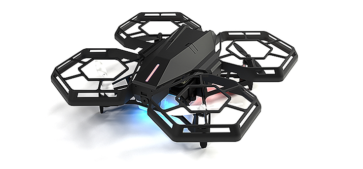

# 들어가며


이 공간은 pinkwink와 robolink가 함께하는 공간입니다. 즐거운 로봇 공부를 위해 pinkwink 블로그에서 이곳 pinklab으로 체계적 관리가 필요한 글을 옮기거나 다시 작성하고 robolink의 다양한 로봇을 대상으로 AI 로봇 교육을 시작하는 곳입니다.


처음 로봇에 관심을 가지던 때는 [카트형 역진자 시스템의 제어기](https://pinkwink.kr/36)를 꾸미던 학부 4학년때였습니다. 그 후 부족한 실력을 아쉬워하며 느리지만 차근차근 연구하려 노력했습니다. 그러면서 저는 [PinkWink](https://pinkwink.kr/)라는 개인 블로그를 운영했습니다. 항상 제가 공부한 내용을 공유하고 또 평가받기를 원했습니다. 그런데 개인 블로그이다 보니 제 개인적인 글들도 작성하게 되고, 또 다양한 분야의 글을 올리면서 깊이 있는 내용을 정리해서 작성하기가 어려웠습니다.

그러다가 [로보링크](http://www.robolink.co.kr/web/)를 만나게 되었습니다. 로보링크는 교육용 로봇 분야에서 재미있으면서 또 알찬 성과를 많이 확보한 회사입니다. 코딩으로 접근가능한 드론, 자율주행용 로봇 등 멋지게 재미있는 로봇을 다수 출시했습니다. 로보링크의 좋은 로봇들은 로봇과 코딩을 학습하려는 많은 분들에게 도움이 될 것이라고 생각했습니다.

그래서 이 공간 **pinklab-robolink**를 만들었습니다. 이 공간에는 로보링크의 제품을 바탕으로 로봇과 코딩과 AI를 이야기하려고 합니다. 최근 저는 **AI-로봇**이라는 주제에 많은 관심을 가지고 이야기를 풀어보려고 노력중이었습니다. 그 중 입문자용 로봇으로 할 수 있는 다양한 AI-로봇의 내용과 주제를 다룰 수 있을 것으로 생각했습니다.

# 로보링크는
비록 작은 규모의 회사이지만 로봇 교육에 필요한 로봇 제품은 잘 갖추고 있습니다.

로보링크의 제품은 아이부터 어른까지 즐겁게 사용할 수 있으며 아두이노, 라즈베리파이를 이용해서 학습을 진행하려는 분들에게 적합한 로봇을 다수 가지고 있습니다.

특히 아주 안전한 드론인 코드론도 코딩을 공부를 위해 준비되어 있습니다.

