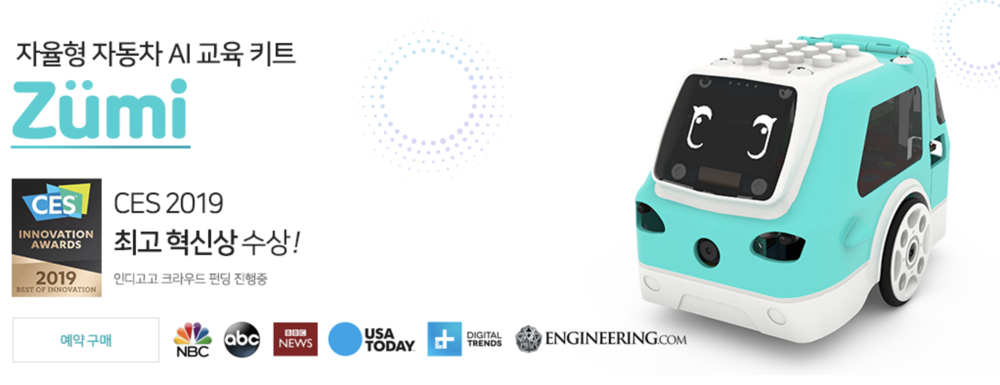

# 들어가며

**로봇**은 우리에게 멀기도 하고 또 가깝기도 한 것 같습니다. 로봇을 만드는 사람들은 아직 세상에 대한 준비가 되지 않았는데, 벌써 사람들은 로봇을 기다리고 있습니다. 이 경계선에서 우리는 로봇을 공부하려는 많은 분들에게 로봇을 공부하기 위한 많은 방법을 알려드리기 위해 이 페이지를 준비했습니다.

로봇은 곧 우리 곁에서 우리와 함께 살아갈 존재가 될 것입니다. 로봇이 우리 곁에 빨리 오도록 어쩌면 여러분들이 큰 역할을 할 수 있습니다. 우리는 로봇을 이해하고 사용하고 응용하는 과정을 이 페이지에 담을 예정입니다.

# 로보링크는

여기 내용 채울 것


# 핑크랩 PinkLAB 은?

여기 내용 채울 것
