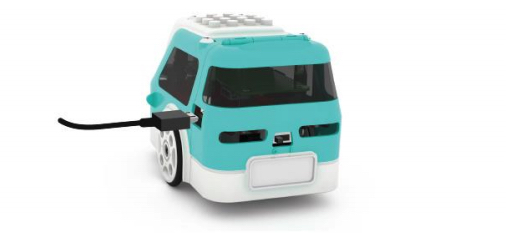
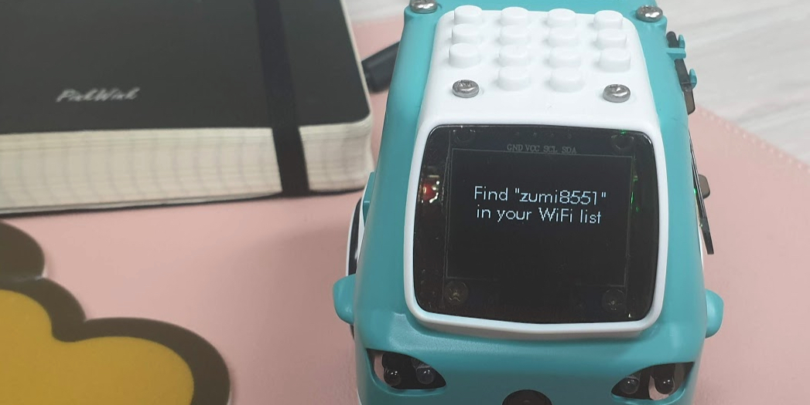
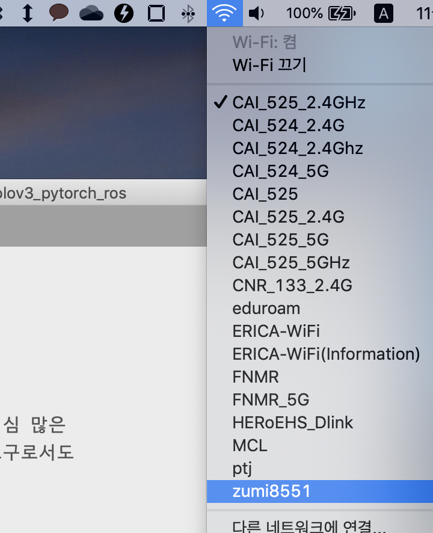
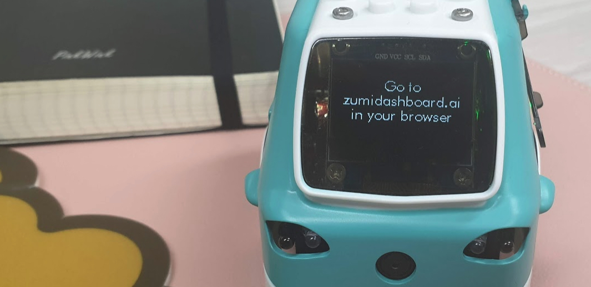
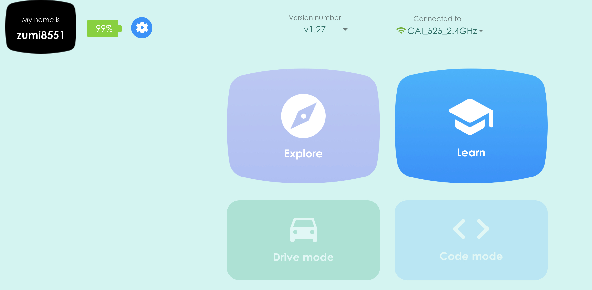
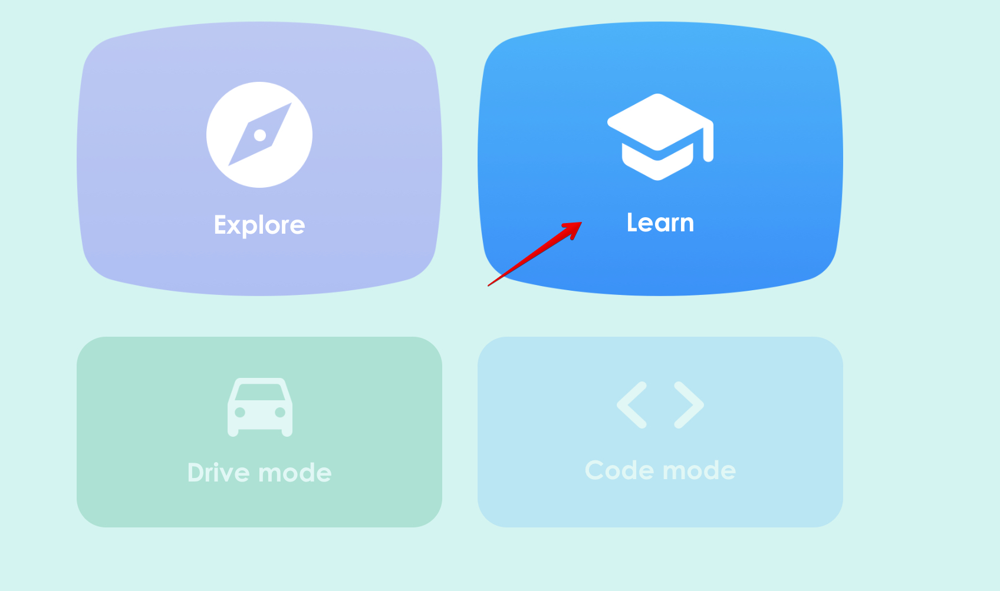
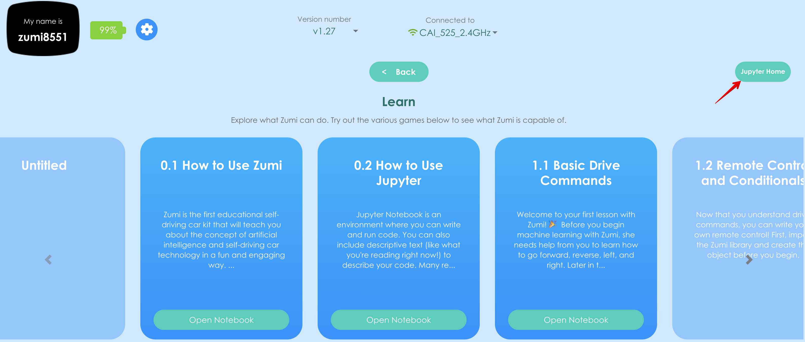
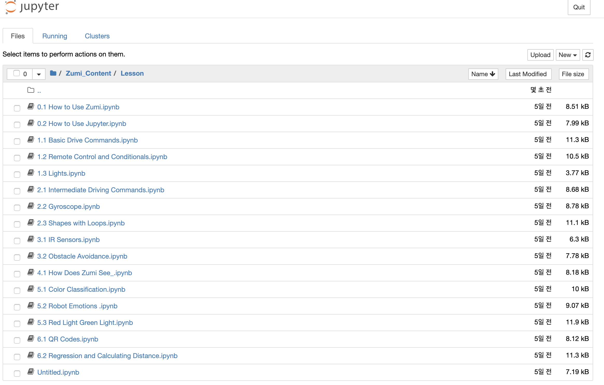
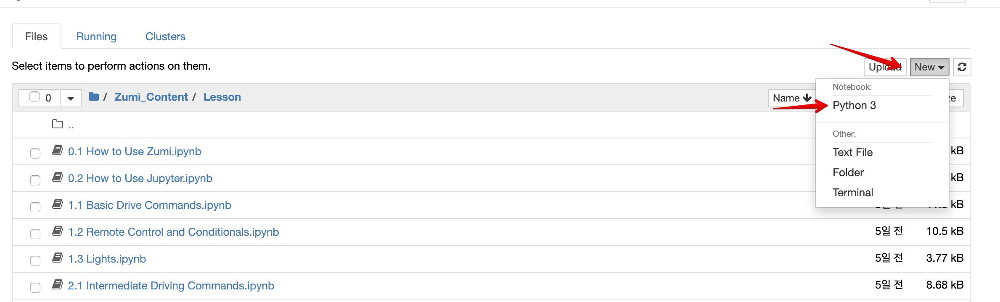
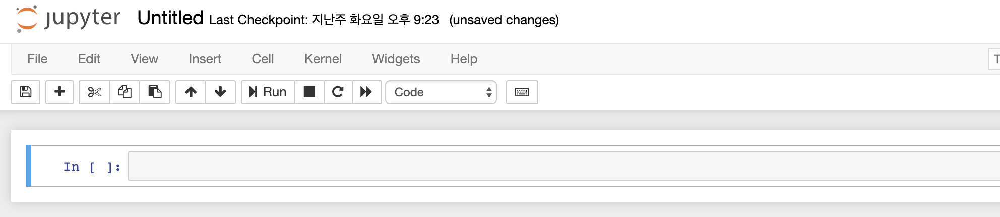

# 주미 : 자율형 자동차 AI 교육 키트

> The car that learns as you learn

**주미**는 여러분과 로봇공학, 코딩, 및 인공지능에 대해 함께 배워 나갈 호기심 많은 자율 주행 자동차입니다. 주미는 간결하고 학습하기 용이한 Python을 익히는 도구로서도 훌륭한 교재입니다. 

주미는 위 그림의 스위치가 꺼져있는 상황에서만 충전이 가능합니다. 

주미의 스위치를 켜면 위 그림처럼 접속해야할 와이파이 이름이 나타납니다.

위 그림처럼 wifi를 바꿉니다.

이제 주미가 안내하는 웹주소를 웹브라우저에 입력합니다.

그러면 위 그림처럼 주미와 소통할 수 있는 대쉬보드에 접속할 수 있습니다. 

주미 대쉬보드에서 **Learn**항목을 선택합니다.

# 빈 Jupyter Notebook 화면 찾아가기

Learn 항목에는 주미로 할 수 있는 정말 많은 일들을 보여주고 있습니다. 그 항목 하나하나를 따라가다 보면 여러분들은 로봇과 인공지능을 모두 다 공부할 수 있을 지도 모릅니다. 우리는 일단 처음부터 진행하기 위해 오른쪽 위에 있는 Jupyter Home을 선택해 주세요.

그러면 현재 주미가 여러분에게 제공하는 많은 예제가 보일겁니다.

화면 오른쪽 상잔의 New 버튼을 누르고 Python3을 선택합니다.

이제 이 화면을 만났습니다. 이 화면은 여러분에게 파이썬을 즐겁게 공부할 수 있는 환경을 제공해줄 것입니다.

# 자료

* Zumi 공식 한글 매뉴얼 [매뉴얼 다운로드 받기](./pdf/Zumi_userguide_v1.pdf)
* Zumi 퀵스타트 영문 매뉴얼 [매뉴얼 다운로드 받기](./pdf/build_guide-compressed.pdf)