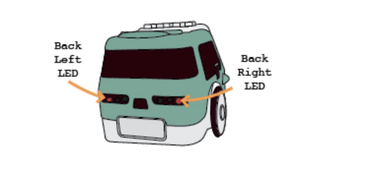

# 들어가며

주미는 간결하고 학습하기 용이한 Python을 익히는 도구로서도 훌륭한 교재입니다. 당연히 주미는 강력한 기능을 가진 Python을 이용해서 보다 많은 기능을 또한 손쉽게 구현할 수 있습니다. 이번 과정은 Python의 간단한 문법부터 로봇 주미를 학습하는 과정까지를 다루고 있습니다. 그 중에서 첫 번째 글은 Hello World라고 흔히들 부르는 단계부터 시작해보겠습니다. 

# 준비과정

# 오늘의 목표



주미는 뒷면에 자동차로 치면 브레이크 등의 역할을 하는 LED가 장착되어 있습니다. 이 LED를 끄고 켜는 동작을 Python으로 수행하도록 하겠습니다. 우리는 드디어 이 간단한 LED를 동작시키는 과정에서 Python의 아주 기초도 함께 다루도록 하겠습니다.

# 코드 설명

우리가 가장먼저 해야할 일은 주미의 하드웨어 자원을 사용할 수 있게 해주는 zumi 모듈을 임포트(import)하는 것입니다. 일단, zumi 모듈이 어떤 것인지 알아야겠네요. 주미에서 로봇 하드웨어를 다룰 수 있는 많은 기능을 포함한 모듈입니다. 그 속에는 로봇의 기울어지는 각도를 측정한다든지, 적외선 센서의 값을 확인하거나, LED와 부저를 다루는 영역에서 카메라 영상을 다루고 LCD 화면에 출력을 하는 기능까지를 구현할 수 있는 기능을 포함하고 있습니다. 

Python은 비슷한 기능을 모아서 모듈로 만들고 그 모듈을 사용자들이 임포트(import)라는 과정을 거쳐서 사용할 수 있게 하고 있습니다. 그래서 우리는 주미를 사용하기 위해서는 일단 zumi 모듈을 import 해야합니다.

``` python
import time
```

Python에서 모듈을 import하는 가장 간단한 방법은 위 코드처럼 import 명령 뒤에 원하는 모듈명을 적는 것입니다. 만약 time 모듈안에 sleep이라는 초(second) 단위로 멈출 수 있는 함수를 사용하고 싶다면

``` python
time.sleep(1)
```

위 코드처럼 사용하면 코드가 실행되는 중간에 1초를 멈추게 됩니다.

# 실행 결과


