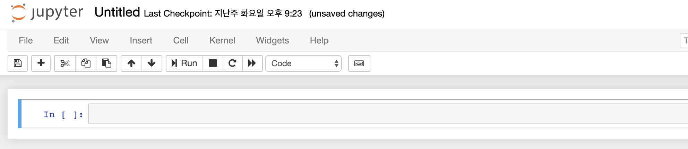
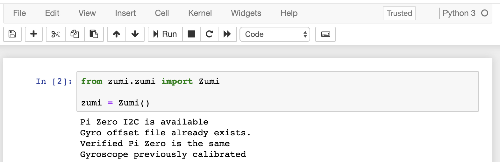

# 들어가며

주미는 간결하고 학습하기 용이한 Python을 익히는 도구로서도 훌륭한 교재입니다. 당연히 주미는 강력한 기능을 가진 Python을 이용해서 보다 많은 기능을 또한 손쉽게 구현할 수 있습니다. 이번 과정은 Python의 간단한 문법부터 로봇 주미를 학습하는 과정까지를 다루고 있습니다. 그 중에서 첫 번째 글은 Hello World라고 흔히들 부르는 단계부터 시작해보겠습니다. 

# 준비과정

앞 선 글에서 수행했던 마지막 화면이 기억나시나요?



완전히 빈 새로운 화면이었습니다. 우리는 여기서 부터 시작해보려고 합니다.


화면 상단에 **untitled**라고 되어 있는 부분이 있습니다. 여기를 클릭합니다.


여기에 **Hello World**라고 입력해서 문서의 이름을 변경하도록 합니다. 이 이름은 **Hello World.ipynb**이라는 이름으로 **주미**에 저장됩니다.

```python
print('Hello! World')
```

이제 정말 간단한 코드하나를 입력해 보겠습니다. print는 Jupyter Notebook 화면에 글자를 출력하는 명령입니다.


Jupyter Notebook에는 이렇게 입력하면 됩니다. 그리고 실행은 키보드에서 <SHIFT>키와 <ENTER>키를 누르면 됩니다.


그러면 위 그림처럼 실행되는 것을 확인할 수 있습니다. 이제 앞으로 주미의 Jupyter Notebook 화면에서 **실행**한다고 말하면 그것은 <SHIFT>키와 <ENTER>키를 눌러서 실행한 것이라고 생각하면 됩니다.

# 오늘의 목표


주미는 뒷면에 자동차로 치면 브레이크 등의 역할을 하는 LED가 장착되어 있습니다. 이 LED를 끄고 켜는 동작을 Python으로 수행하도록 하겠습니다. 우리는 드디어 이 간단한 LED를 동작시키는 과정에서 Python의 아주 기초도 함께 다루도록 하겠습니다.

# 코드 설명

우리가 가장먼저 해야할 일은 주미의 하드웨어 자원을 사용할 수 있게 해주는 zumi 모듈을 임포트(import)하는 것입니다. 일단, zumi 모듈이 어떤 것인지 알아야겠네요. 주미에서 로봇 하드웨어를 다룰 수 있는 많은 기능을 포함한 모듈입니다. 그 속에는 로봇의 기울어지는 각도를 측정한다든지, 적외선 센서의 값을 확인하거나, LED와 부저를 다루는 영역에서 카메라 영상을 다루고 LCD 화면에 출력을 하는 기능까지를 구현할 수 있는 기능을 포함하고 있습니다. 

Python은 비슷한 기능을 모아서 모듈로 만들고 그 모듈을 사용자들이 임포트(import)라는 과정을 거쳐서 사용할 수 있게 하고 있습니다. 그래서 우리는 주미를 사용하기 위해서는 일단 zumi 모듈을 import 해야합니다.

### import zumi

``` py
from zumi.zumi import Zumi

zumi = Zumi()
```

아마 위 과정은 얻듯 이해하기는 어려울 수 있습니다. 위 두 줄은 간단해 보이지만 파이썬에서 꽤 중요한 개념들을 가지고 있습니다. 그러나 지금 이를 설명하는 것은 난이도의 문제와 로봇 주미를 사용하는 목적에 비춰 너무 깊다고 생각합니다. 그래서 간략하게 설명하고 지나가려고 합니다. 그러나 분명 주미를 파이썬으로 학습하는 과정을 거치다 보면 여러분들은 점점 이해하게 될 것입니다.

먼저 첫 줄은 zumi.zumi 모듈에서 Zumi라는 모듈을 가져오는(import) 것입니다. 그리고 나서 zumi이름으로 이를 사용할 수 있도록 하는 과정이 두 번째 줄입니다. 이 과정에서는 클래스(class), 인스턴스(instance), instanciation 등의 어려운 용어가 등장할 수도 있지만, 파이썬의 장점은 일단 넘어가도 된다는 것입니다. 아무튼 위 두 줄의 의미는 우리는 지금 로봇 주미를 사용할 준비가 되었다는 뜻 입니다. 이제 실행해보도록 하죠.



코드의 실행결과가 당황스럽나요? 괜찮습니다. 저 말의 의미는 주미에서 PC로 사용하고 있는 Raspberry PI Zero 보드와 로봇 주미의 주요 제어 기능을 담당하는 보드의 몇몇 주요 기능들이 정상적으로 사용할 수 있도록 준비가 완료되었다는 뜻 입니다.

### LED 켜보기


주미는 정면에서 바라볼때 하얀색 박스로 표시된 부분의 약간 위쪽에 헤드라이트(headlights)가 있습니다. 그리고 뒷 편에는 브레이크등(brake_lights)이 있습니다.

``` py
zumi.brake_lights_on()
```

위 코드는 브레이크등을 켜는 명령입니다. 이 명령을 실행하면 주미 뒷면의 등이 켜지게 됩니다.

``` py
zumi.brake_lights_off()
```

브레이크등을 끄는 명령입니다.


여러분들은 위 코드를 하나씩 입력해서 실행(<SHIFT>+<ENTER>)하면서 주미의 어떤 LED가 꺼지고 켜지는지를 확인해보세요.