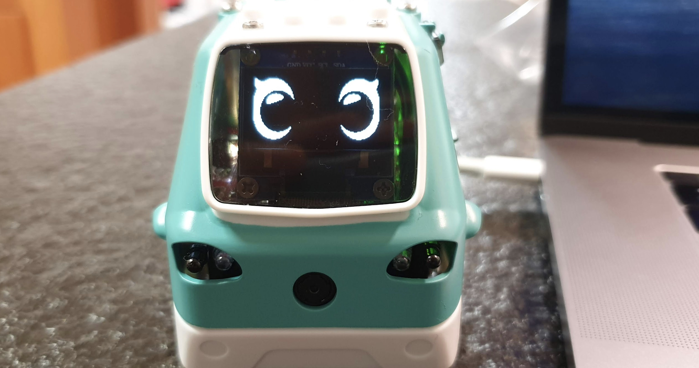

# 주미 화면에 출력하기

이번에는 주미의 화면에 글자나 표정을 출력하는 내용을 이야기합니다. 단순한 표현 혹은 출력이라고 생각할 수 있지만, 코딩을 하는 혹은 코딩을 공부하는 사람 입장에서는 자신의 코드의 중간 결과 혹은 로봇의 상태를 자주 확인하고 싶을 때가 있습니다. 그럴때 적절히 화면에 현재 상태를 알려주는 기능이 필요합니다. 또 로봇의 감정이나 로봇이 응답하도록 만들려고 해도 화면에 출력하는 기능은 필요합니다. 이런 중요한 기능의 첫 시작부분을 이번에 다룰려고 합니다.

# zumi.util.screen

주미의 화면 출력에 관련된 함수들은 **zumi.util.screen**에 모여 있습니다.

```py
from zumi.util.screen import Screen 
screen = Screen()
```

이렇게 먼저 zumi.util.screen의 Screen을 import합니다. 그리고 screen이라는 변수를 지정해 둡니다. 이 과정은 instanciation이라는 과정인데 아직은 깊이 있게 고민하지 말고 일단 그대로 진행하도록 하겠습니다. 여기서는 screen이라는 이름의 변수를 통해 주미의 화면을 제어할 수 있다고 생각하면 될 듯 합니다.

```py
screen.__dir__()
```

만약 어떤 모듈에서 사용하는 기능의 목록이 궁금하다면 **__dir__()**을 호출하면 됩니다. 그러면 사용할 수 있는 명령이 주어집니다. 아직은 docstring이라고 부르는 물음표(?)를 통해 함수의 설명을 확인하는 기능은 준비되지 않았지만, 주미에서 사용하는 [Python Library의 공식 메뉴얼](http://docs.robolink.com/zumi-library)을 참조해도 됩니다. 


# 함수의 실제 사용

### zumi.util.screen.hello()

```py
screen.hello()
```



### zumi.util.screen.blink()

```py
screen.blink()
```


### zumi.util.screen.happy()

```py
screen.happy()
```


### zumi.util.screen.angry()

```py
screen.angry()
```


### 기타 함수


나머지 함수들도 동일하게 하나씩 실행해보면서 기능을 확인해보세요.

### zumi.util.screen.draw_text()

```py
screen.draw_text("hello")
```


draw_text 함수는 화면의 좌측 상단에 글자를 출력합니다. 원하는 위치와 폰트의 크기도 조절 가능합니다. 보다 상세한건 [Python Library의 공식 메뉴얼](http://docs.robolink.com/zumi-library)을 참조하시면 됩니다. 우리가 주미를 다루는 동안 보다 더 많은 기능을 소개하게 되니 크기 걱정하지 않아도 됩니다.

### zumi.util.screen.clear_display()

```py
screen.clear_display()
```

주미의 화면을 지우고 싶으면 clear_display()를 실행하면 됩니다.

### zumi.util.screen.draw_text_center()

```py
screen.draw_text_center("Hi. Hello. Happy X-Max!")
```


먼저, X-Max라는 글자가 틀렸네요. 저는 영어공부를 보다 열심히 해야할 것 같습니다.ㅠㅠ. 아무튼 draw_text_center는 가운데에 글자를 출력하는 명령입니다.


